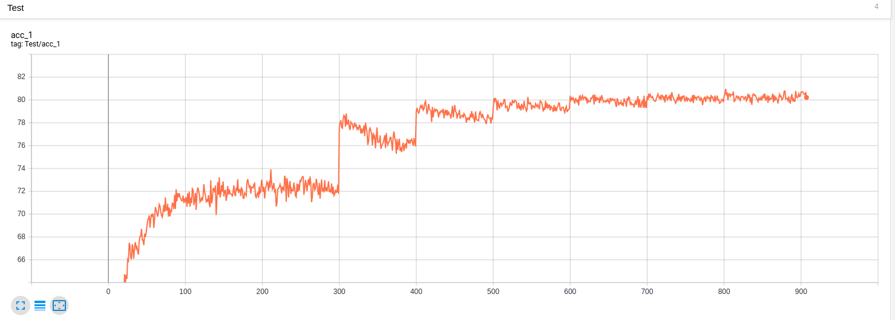
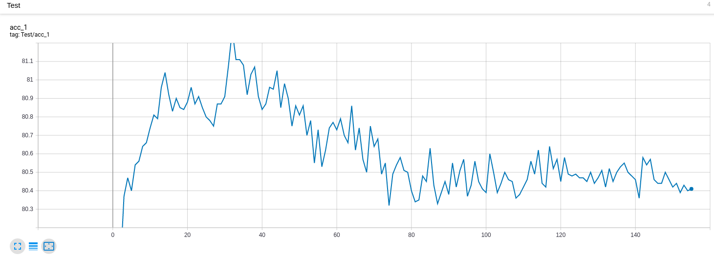
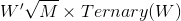
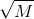
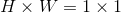

# MSUNet
MSUNet-v1 is a deep convolutional neural network that competes in the CIFAR-100 image classification task in the 2019 NeurIPS MicroNet Challenge. 

It exploits the power of mixed depthwise convolution, quantization and sparsification to achieve lightweight yet effective network architecture.

### Results

|Model | Top-1 Test Accuracy | #Flops | #Parameters| Score|
|---|---|---|---|---|
|MSUNet-v1| 80.47%| 118.6 M| 0.2119 M|0.01711|


We follow the training-and-pruning pipeline, where we first train a network with ternary weights and then prune the network to further sparsify the squeeze-excitation layers.
 
**The test accuracy in the training stage:**


**The test accuracy in the pruning stage:**

Not that the model reached the target sparsity after 100 epochs.

### Design details

MSUNet-v1 is designed based on two key techniques: 1) ternary conv layers; and 2) sparse SE (squeeze-excitation) layers.
The details of these two techniques are briefly describe below. 

In terms of implementation, we use pytorch to implement our model. Our repository is built on top of [pytorch-image-models](https://github.com/rwightman/pytorch-image-models) (by Ross Wightman).

* **Ternary convolutional layers**

    * Some convolutional layers are ternarized, i.e., the weights are either -1, 0 or +1. 
    * Although our implementation allows binary weight, we find that ternary weights generally perform better then binary. Therefore, we stick to ternary weights for some convolution layers.
    * We follow an approach similar to [Training wide residual networks for deployment using a single bit for each weight](https://arxiv.org/abs/1802.08530) to represent the ternary weights, that is, 
    ( where *W* is the full precision weight, *Ternary(W)* quantizes the weight to (-1,0,+1) and  is a multiplier that scales all the weights in a particular convolutional layer. 
    
    * The piece of code that reflects the ternary operation is as below 
    ```python
    class ForwardSign(torch.autograd.Function):
          @staticmethod
          def forward(ctx, x):
              global alpha
              x_ternary = (x - x.mean())/x.std()
              ones = (x_ternary > alpha).type(torch.cuda.FloatTensor)
              neg_ones = -1 * (x_ternary < -alpha).type(torch.cuda.FloatTensor)
              x_ternary = ones + neg_ones
              multiplier = math.sqrt(2. / (x.shape[1] * x.shape[2] * x.shape[3]) * x_ternary.numel() / x_ternary.nonzero().size(0) )
              x_ternary = multiplier * x_ternary
              return(x_ternary.type(torch.cuda.FloatTensor))

          @staticmethod
          def backward(ctx, g):
              return g
    ```
    * As there is a scale factor  for the weights and we are implementing fake quantization, we assume that the multiplicatin of scale factor  is performed **after** convolving the input with **ternary weights**. 
    * Also note that as the ternary weights tends to be sparse in our implementation, we assume that they are compatible with sparse matrix storage and sparse math operation.
    * Therefore, the overall flops is calculated from three parts: 1) sparse 1-bit (-1, 1) multiplication in the convolution operation; 2) sparse 32-bit addition in the convolution operation; and 3) 32-bit multiplication for multiplying the scale factor on the output of the layer.
    * And the number of parameters is calculated from three parts: 1) 1-bit (-1,1) representation of the non-zero values in weights; 2) bitmask of the full weights; 3) 1 full precision scale factor for each convolutional layer.
 
* **Sparse Squeeze-excitation layers**
    * The same as [pytorch-image-models](https://github.com/rwightman/pytorch-image-models), we use 1x1 convolution performed on features with spatial dimension  to perform squeeze-and-excitation, which is equivalent to the fully connected layer implementation.
    * In order to make the weights sparse, we perform pruning on the weights of squeeze-excitation layer.
    * Therefore, the number of additions and multiplication comes from the sparse 1x1 convolution.
    * And the number of parameters comes from two pars: 1) full precision non-zeros values of the weights; 2) bitmask of the full weights.
    
* **Scoring**
    * As stated above, layers with ternary weights are counted as sparse 1-bit multiplications, sparse 32-bit additions and sparse 1-bit sparse matrix storage. We include the following code in `counting.py` to calculate the sparsity, bit mask and quantization divider:
    ```python
          if hasattr(m, '_get_weight'):
                # The module having _get_weight attributed is Ternarized.

                # Ternary weight is considered as sparse binary weights,
                # so we use a quantization divider 32 for multiplication and storage.
                bd = 32 # quantization divider for multiplication
                if binarizable == 'T':
                    # Using ternary quantization
                    # print('Using Ternary weights')

                    # Since ternary weights are considered as sparse binary weights,
                    # we do have to store a bit mask to represent sparsity.
                    local_param_count += c_out * c_in * k * k / 32 # The bit mask
                    sparsity = (m._get_weight('weight').numel() - m._get_weight('weight').nonzero().size(0)) / m._get_weight('weight').numel()
          
                    # Since our ternary/binary weights are scaled by a global factor in each layer,
                    # we do have to store a full precision digit to represent it.
                    local_param_count += 1 # The scale factor

                elif binarizable == 'B':
                    # Using binary quantization
                    # Although we support binary quantization, our we prefer to use ternary quantization.
                    # print('Using Binary weights')
                    # The scale factor
                    local_param_count += 1
                    sparsity = 0

                else:
                    raise ValueError('Option args.binarizable is incorrect')
                
                # Since our ternary/binary weights are scaled by a global factor in each layer,
                # which can be considered as multiplying a scale factor on the output of the sparse binary convolution.
                # We count it as full precision multiplication on the output.
                local_flop_mults += np.prod(output.size())  # For globally *np.sqrt(sqrt(2/(F**2*C))
                
              
        ...
      
                # Number of parameters
                local_param_count += c_out * c_in * k * k / bd * (1-sparsity)
                # Number of multiplications in convolution
                local_flop_mults += (k * k * c_in) * (1-sparsity) * np.prod(output.size()) / bd
                # Number of full precision (32-bit) addition in convolution
                local_flop_adds += (k * k * c_in * (1-sparsity) - 1) * np.prod(output.size())
                # The parameters and additions for the bias
                if m.bias is not None:
                      local_param_count += c_out
                      local_flop_adds += np.prod(output.size())


    ```
    * The squeeze-excitation layers are also sparse, but we did not separate them from the normal convolution layer for implementation convenience. 
    We thus includes the following code in `counting.py` to find the 6 sparse squeeze-excitation layers and calculate the corresponding sparsity, bit mask and quantization divider:
    ```python
          ...
        
          else:
                # No quantization is performed
                bd = 1
              
                # Some layers are sparsed, we count those layers that have sparsity > 0.5
                sparsity_ = (m.weight.numel() - m.weight.nonzero().size(0)) / m.weight.numel()
                # The layers with sparsity < 0.5 does not count
                if sparsity_ < 0.5: 
                    sparsity = 0
                # Only 6 squeeze-excitation conv layers have sparsity > 0.5
                else: 
                    sparsity = sparsity_ 
                    # The bit mask for sparse weights
                    local_param_count += c_out * c_in * k * k / 32 
           
         ...
       
                # Number of parameters
                local_param_count += c_out * c_in * k * k / bd * (1-sparsity)
                # Number of multiplications in convolution
                local_flop_mults += (k * k * c_in) * (1-sparsity) * np.prod(output.size()) / bd
                # Number of full precision (32-bit) addition in convolution
                local_flop_adds += (k * k * c_in * (1-sparsity) - 1) * np.prod(output.size())
                # The parameters and additions for the bias
                if m.bias is not None:
                      local_param_count += c_out
                      local_flop_adds += np.prod(output.size())

    ```
    * The flops and parameters are counted by their respective forward hooks.

### Evaluation
* **Requirements**
    * torch>=1.2.0
    * torchvision >= 0.4.0
    * pyyaml
    * tensorbarodX
    ```bash
    conda create -n MSUnet python=3.7
    conda activate MSUnet
    conda install pytorch torchvision cudatoolkit=10.0 -c pytorch
    conda install pyyaml
    pip install tensorboardX
  
    ```
    Currently we only support running on a signle GPU.
    
* **Validate the accuracy with pretrained checkpoint**

To validate the accuracy with a pretrained checkpoint, please run
```bash
python validate.py ~/Downloads/Data/CIFAR100 --model MSUnet_CIFAR100 --num-classes 100 --batch-size 32 -j 8 --img-size 32 --binarizable T --alpha 0.67749 --initial-checkpoint ./output/train/20191001-213056-MSUnet_CIFAR100-32/Last/checkpoint-156.pth.tar
```
* **Validate the score with pretrained checkpoint**

To validate the score with a pretrained checkpoint, please run
```bash
python counting.py --binarizable T --initial-checkpoint ./output/train/20191001-213056-MSUnet_CIFAR100-32/Last/checkpoint-156.pth.tar

```
* **Train the network from scratch**

We follow the training-and-pruning pipeline, where we first train a network with ternary weights and then prune the network to further sparsify the squeeze-excitation layer. 

To train the network with ternary weights from scratch
```bash
python train_consistency.py ~/Downloads/Data/CIFAR100 --model MSUnet_CIFAR100 --num-classes 100 --lr 0.1 --epochs 910 --start-epoch 0 --sched step --decay-epochs 300 400 500 600 700 800 900 --decay-rate 0.25 --batch-size 64 -j 8 --opt sgd --warmup-epochs 5 --img-size 32 --drop 0.0 --binarizable T --mixup 1.0 --cutmix_prob 0.5 --softmax-multiplier 1.0 --no-prefetcher
```

After training is finished, we then prune the weights of squeeze-excitation layers from the checkpoint generated from the above script
```bash
python train_consistency.py ~/Downloads/Data/CIFAR100 --model MSUnet_CIFAR100 --num-classes 100 \ 
 --sched cosine --batch-size 192 -j 8 --opt sgd --img-size 32 --drop 0.0 --binarizable T \ 
 --resume ./output/train/20190930-184940-MSUnet_CIFAR100-32/Top/model_best.pth.tar \ 
 --start-epoch 0 --warmup-epochs 0 --epochs 1 --lr 1e-3 --min-lr 5e-4 --reset-lr-scheduler 1e-3 --decay-rate 1 \ 
 --alpha 0.67749 --cycle-limit 150  --mixup 0 --softmax-multiplier 1 --freeze-binary --clean-train --prune
```


